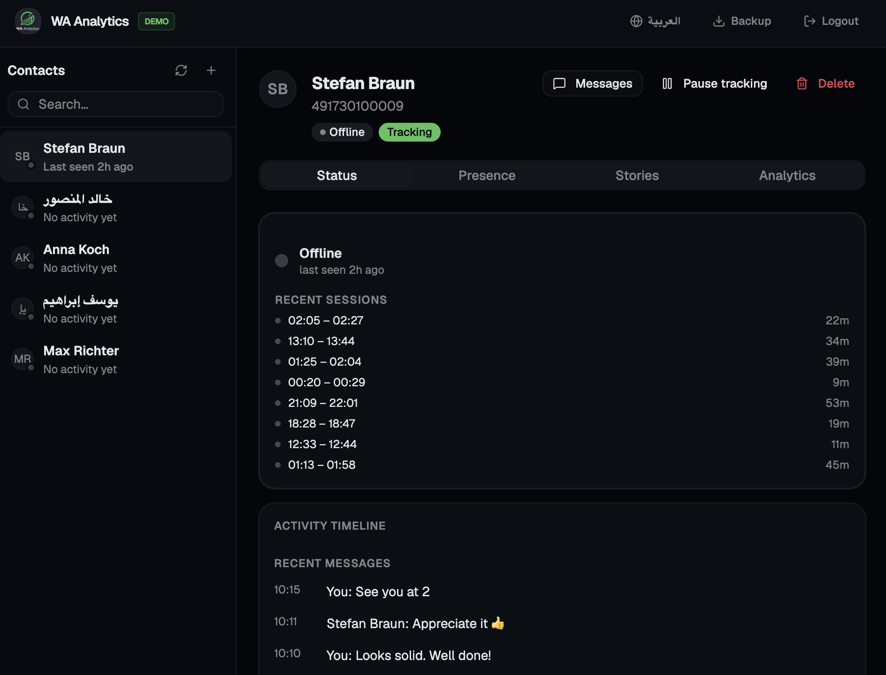
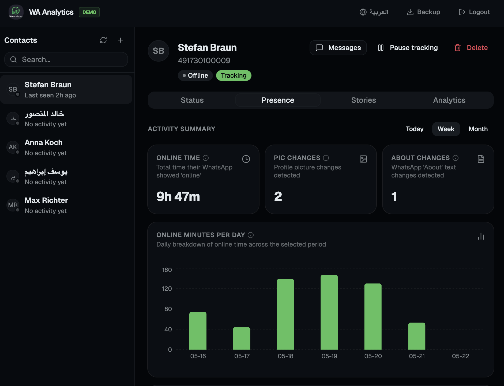
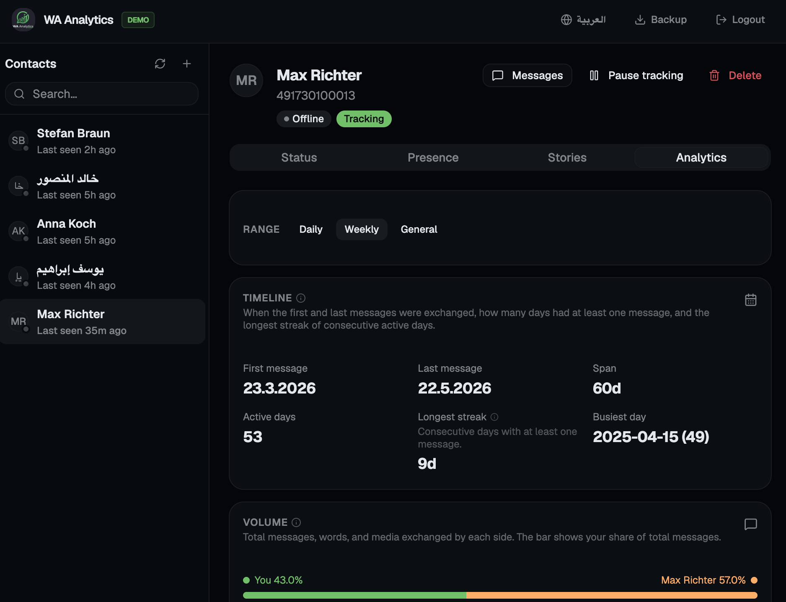
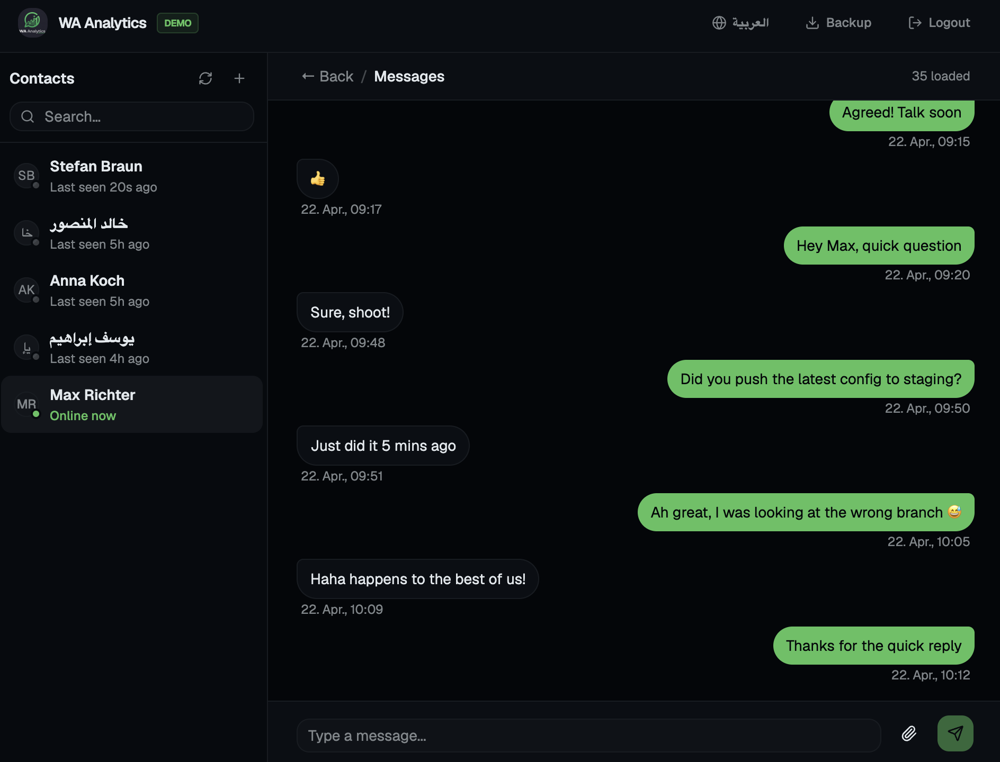
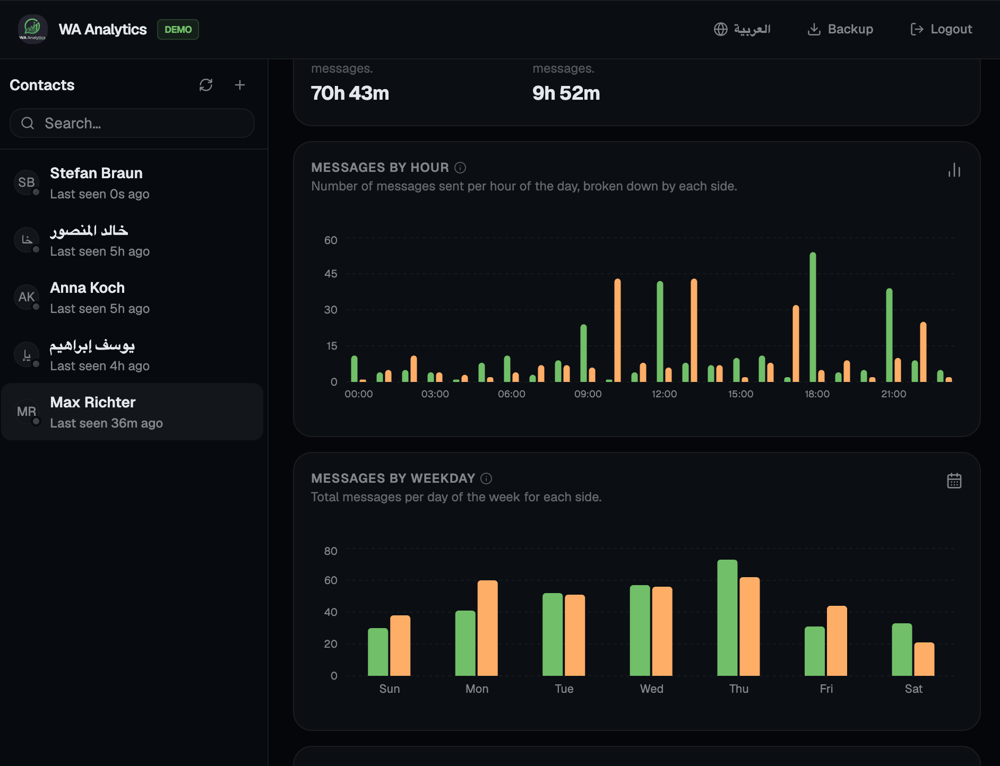

<p align="center">
  
</p>

<h1 align="center">WA Analytics</h1>

<p align="center">
  <strong>Your private WhatsApp — with superpowers.</strong>
</p>

<p align="center">
  <a href="https://github.com/ibrahimalshekh/wa-analytics/blob/main/LICENSE">
    
  </a>
  
  
  
  
  <a href="https://github.com/ibrahimalshekh/wa-analytics/stargazers">
    
  </a>
</p>

<p align="center">
  
  
  
  <a href="https://ibrahimalshekh.github.io/wa-analytics">
    
  </a>
</p>

---

**WA Analytics** is an open-source, self-hosted WhatsApp analytics platform. Pair your own WhatsApp account, add the contacts you care about, and get a private real-time dashboard with deep conversation insights — presence patterns, message analytics, emotional trends, response times, and more. Everything runs on your own machine or private server. No cloud. No third-party services. Your data never leaves your hands.

**[→ Try the live demo](https://ibrahimalshekh.github.io/wa-analytics)**

---

> **⚠️ LEGAL DISCLAIMER**
>
> This software is intended for personal use and educational purposes only. It interacts with WhatsApp through [`whatsmeow`](https://github.com/tulir/whatsmeow) — a non-official implementation of the WhatsApp multi-device protocol. Use is **entirely at your own risk**.
>
> The developer is **not affiliated with WhatsApp LLC or Meta Inc.** WhatsApp may suspend or permanently ban accounts that use unofficial clients or engage in automated behavior. The developer assumes **no responsibility** for account bans, data loss, or legal consequences.
>
> By using this software you confirm that you are solely responsible for compliance with WhatsApp's Terms of Service and all applicable laws in your jurisdiction. **Use a secondary number you can afford to lose.**

---

## Screenshots

| Status & Timeline                           | Presence Patterns                               |
| ------------------------------------------- | ----------------------------------------------- |
|  |  |

| Deep Analytics                                    | Chat Messages                                            |
| ------------------------------------------------- | -------------------------------------------------------- |
|  |  |



---

## What It Does

WA Analytics connects to WhatsApp as a linked device on your account — just like WhatsApp Web. You pick which contacts to observe, and it quietly runs in the background collecting data and surfacing it through a real-time dashboard.

### See who's online, when

Track when your contacts come online and go offline, with exact timestamps. See their full presence history at a glance — daily, weekly, or over any period.

### Never miss a profile change

Every time a contact changes their profile picture or "About" text, it's captured and saved with a timestamp. Browse the full history of every change.

### Read your conversation patterns

WA Analytics goes deep on your message history. It tells you:

- Who sends more messages, and how that balance changes over time
- What hours and days you both tend to talk
- Who usually starts conversations
- How fast each person typically responds
- What emotions come through most often
- Your most-used words, emojis, and shared links
- Streaks, silent periods, and your all-time busiest day

### Watch messages come in live

A real-time feed shows messages as they arrive, with reactions, edits, and deletions. Browse full chat history with media previews — photos, videos, voice notes, documents.

### Run multiple accounts

Connect several WhatsApp numbers to the same installation. Each account has its own contacts, data, and settings, fully isolated.

### 100% private

Everything runs on hardware you control — your laptop, a home server, or a private VPS. No data is ever sent to a third party. You can even set a schedule per account so the app stays completely invisible during certain hours.

---

## Installation

Choose the path that fits your situation:

- **[On your own machine](#on-your-own-machine)** — install on your laptop or desktop. The app runs in the background and is accessible from your browser.
- **[On a private server](#on-a-private-server)** — run it 24/7 on a VPS or home server, accessible from anywhere with a real domain and HTTPS.

---

### On your own machine

#### Step 1 — Install the prerequisites

The installer builds the app from source, so you need a few tools first.

**macOS:**

```bash
# Install Homebrew if you don't have it
/bin/bash -c "$(curl -fsSL https://raw.githubusercontent.com/Homebrew/install/HEAD/install.sh)"

# Install Go, Node, and pnpm
brew install go node
corepack enable pnpm

# Install Xcode Command Line Tools (C compiler, required for SQLite)
xcode-select --install
```

**Linux (Ubuntu / Debian):**

```bash
# C compiler and build tools
sudo apt update && sudo apt install -y build-essential

# Go (1.22+) — download from https://go.dev/dl/ or use your package manager
# Node (20+) — use nvm or your package manager
curl -fsSL https://fnm.vercel.app/install | bash   # fast Node manager
fnm install 20

# pnpm
corepack enable pnpm
```

**Windows:**

1. Install [Go](https://go.dev/dl/) (1.22+)
2. Install [Node](https://nodejs.org/) (20+), then run `corepack enable pnpm` in PowerShell
3. Install [MinGW-w64](https://www.mingw-w64.org/) (provides the C compiler for SQLite)

---

#### Step 2 — Get the code

```bash
git clone https://github.com/ibrahimalshekh/wa-analytics.git
cd wa-analytics
```

---

#### Step 3 — Run the installer

The installer builds the app, installs it as a background service that starts on boot, and optionally maps a local domain.

**Linux / macOS:**

```bash
./scripts/local/install.sh
```

**Windows (run PowerShell as Administrator):**

```powershell
powershell -ExecutionPolicy Bypass -File scripts\local\install.ps1
```

The installer will ask a few questions and show you what it's doing. Accept the defaults unless you have a reason to change them.

---

#### Step 4 — Open the dashboard

Once the installer finishes, open your browser and go to:

```
http://localhost:8080
```

The first time you visit, you'll be asked to create an admin account. Do that, then log in.

> **Important:** The installer also seeds a fallback login — **`admin` / `admin`**. Delete or change it immediately after creating your own account.

> **Back up your encryption key.** The app generates a secret key at `~/.local/share/whatsapp-tracker/.env` on first run. If this file is lost, your stored data cannot be recovered. Copy it somewhere safe:
>
> ```bash
> cat ~/.local/share/whatsapp-tracker/.env
> ```

---

#### Managing the service

The app runs as a background service. You rarely need to touch it, but here's how:

**Linux:**

```bash
systemctl --user status  whatsapp-tracker   # check if it's running
systemctl --user restart whatsapp-tracker   # restart
systemctl --user stop    whatsapp-tracker   # stop
journalctl --user -u whatsapp-tracker -f    # live logs
```

**macOS:**

```bash
launchctl stop  com.whatsapptracker.tracker   # stop
launchctl start com.whatsapptracker.tracker   # start
tail -f ~/.local/share/whatsapp-tracker/tracker.log   # logs
```

**Windows (PowerShell):**

```powershell
Get-Service WhatsAppTracker          # check status
nssm restart WhatsAppTracker         # restart
nssm stop    WhatsAppTracker         # stop
```

---

#### Uninstall

```bash
./scripts/local/uninstall.sh                                             # Linux / macOS
powershell -ExecutionPolicy Bypass -File scripts\local\uninstall.ps1    # Windows
```

Your data directory is **never removed automatically** — delete it manually once you no longer need the data:

- Linux / macOS: `~/.local/share/whatsapp-tracker/`
- Windows: `%LOCALAPPDATA%\whatsapp-tracker\`

---

### On a private server

Running on a server lets the app collect data continuously, 24/7, even when your laptop is off — accessible from any device via a real domain with HTTPS.

See the **[server deployment guide →](docs/deployment.md)** for full step-by-step instructions.

---

## Getting Started

Once the app is running and you've logged in:

1. **Add a WhatsApp account** — click "Add Account" on the dashboard. Scan the QR code with your phone (WhatsApp → Linked Devices → Link a device), or enter your phone number to get a pairing code.
2. **Add contacts** — type a phone number and optional name, or sync contacts directly from your WhatsApp account.
3. **Enable tracking** — toggle tracking on for each contact you want to monitor.
4. That's it. The dashboard starts collecting presence events, profile changes, and messages immediately.

---

## Limitations

- **Privacy settings.** If a contact has "Last Seen: Nobody" enabled or has blocked you, their presence and About won't be visible — that's WhatsApp's behavior.
- **Ban risk.** Using unofficial WhatsApp clients carries a risk of account suspension. Use a secondary number.
- **One session per install.** Each installation holds one WhatsApp session per data directory (but you can add multiple accounts).

---

## Contributing & Bug Reports

WA Analytics is actively developed and improving. If you run into a bug or have a feature idea, please [open an issue on GitHub](https://github.com/ibrahimalshekh/whatsapp-tracker/issues) — describe what happened, what you expected, and your platform. All feedback is welcome and helps make the project better.

Pull requests for bug fixes, improvements, and new features are appreciated.

---

## Documentation

| Doc                                      | Contents                                                         |
| ---------------------------------------- | ---------------------------------------------------------------- |
| [Architecture](docs/architecture.md)     | System design, tech stack, real-time data flow, Mermaid diagrams |
| [API Reference](docs/api.md)             | All REST endpoints, WebSocket message types, auth flows          |
| [Database Schema](docs/database.md)      | Tables, ERD, migrations, analytics aggregation model             |
| [Development Guide](docs/development.md) | Dev setup, build system, how to extend the app                   |
| [Deployment Guide](docs/deployment.md)   | Server deployment with Ansible and manual scripts                |
| [Configuration](docs/configuration.md)   | All flags and environment variables                              |
| [Testing Guide](docs/testing.md)         | How to run tests, mocking strategy, helper overview              |

---

## License

Released under the [MIT License](LICENSE).
Not affiliated with WhatsApp LLC or Meta Inc.
