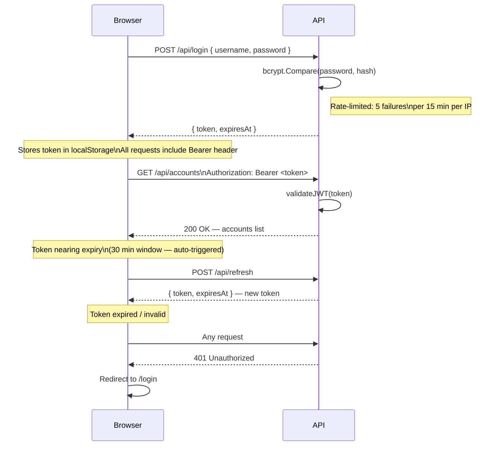
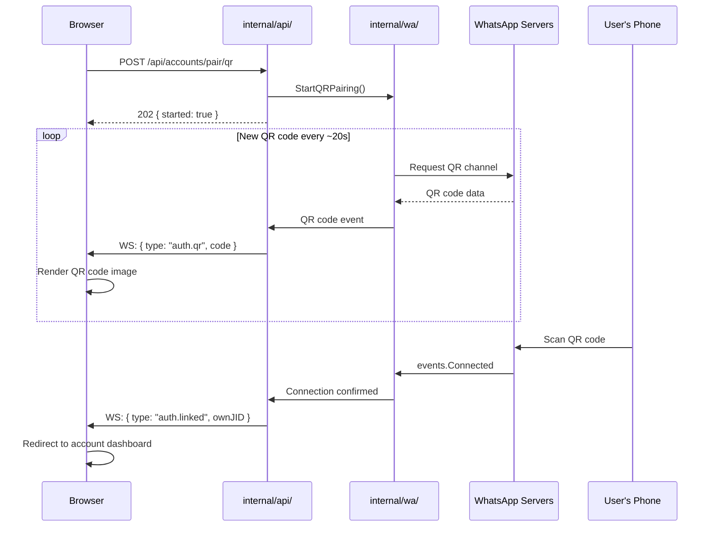
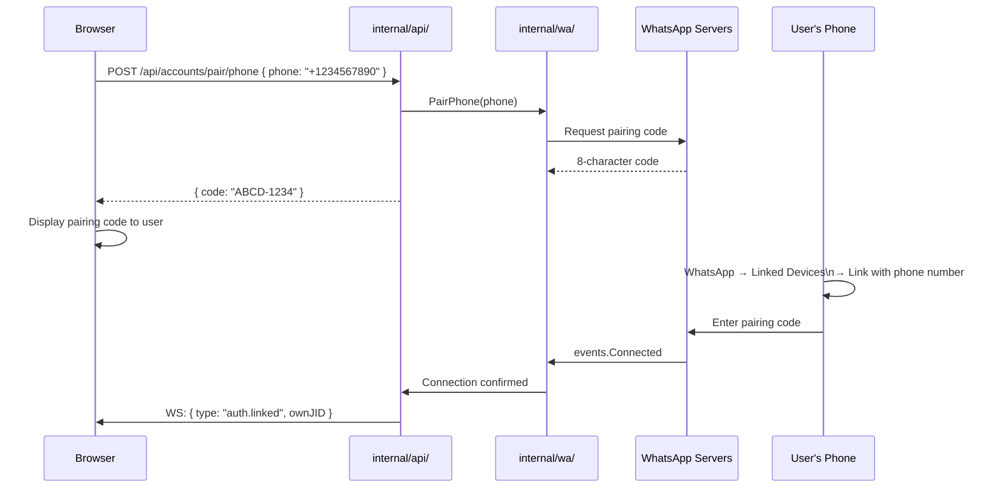
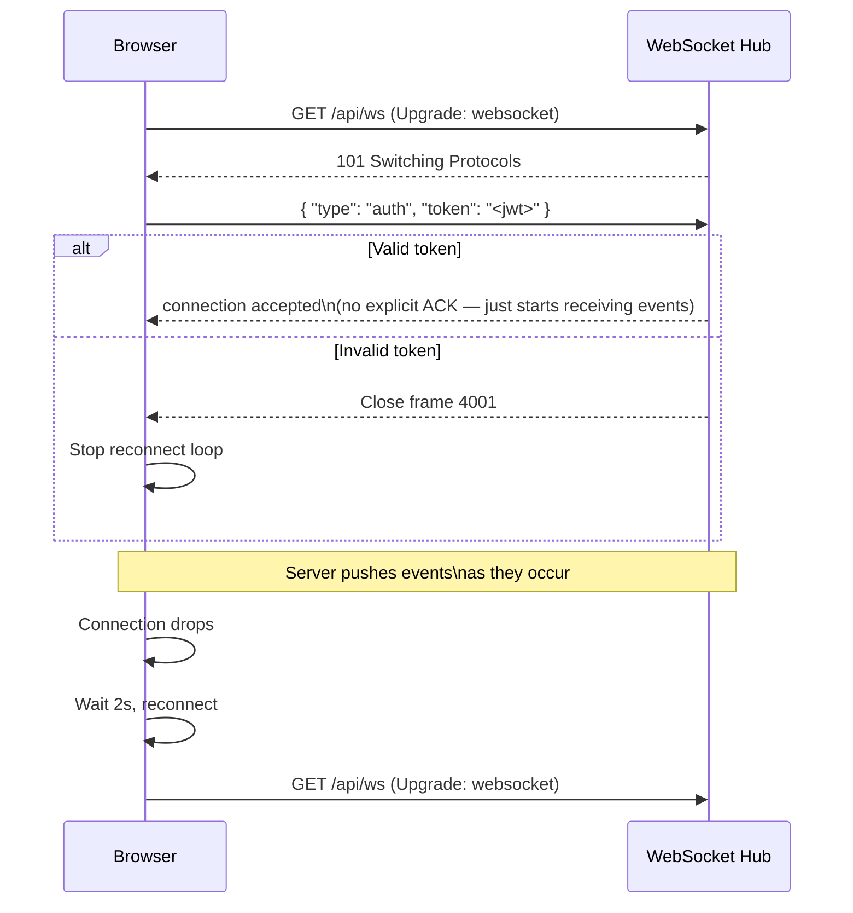
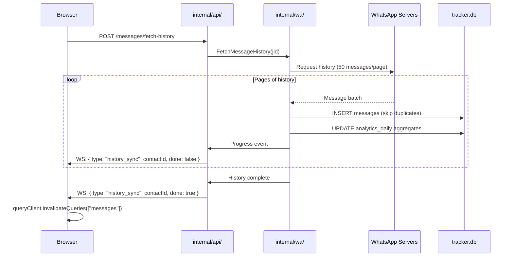

# API Reference

All endpoints are under `/api/`. Protected endpoints require a JWT Bearer token in the `Authorization` header:

```
Authorization: Bearer <token>
```

If `WT_BEARER` is set, that static token must also be present on every request and on the WebSocket URL as `?token=<bearer>`.

---

## Authentication Flows

### JWT Lifecycle



---

### QR Pairing Flow



---

### Phone Number Pairing Flow



---

### WebSocket Connection & Auth



---

## Authentication Endpoints

### `POST /api/login`
Authenticate and receive a JWT.

**Request:**
```json
{ "username": "admin", "password": "hunter2" }
```

**Response:**
```json
{ "token": "<jwt>", "expiresAt": 1234567890 }
```

Rate-limited: 5 failures per 15 minutes per IP.

---

### `POST /api/refresh`
Refresh a JWT before it expires (auto-refresh fires 30 min before expiry).

**Response:**
```json
{ "token": "<jwt>", "expiresAt": 1234567890 }
```

---

### `GET /api/setup/status`
Check if the instance has been initialized (any users exist).

**Response:**
```json
{ "setupRequired": true }
```

---

### `POST /api/setup/register`
Register the first admin user. Permanently closed once any user exists (returns `403`).

**Request:**
```json
{ "username": "admin", "password": "hunter2" }
```

---

## Accounts

### `GET /api/accounts`
List all linked WhatsApp accounts.

**Response:**
```json
[
  {
    "id": 1,
    "jid": "1234567890@s.whatsapp.net",
    "label": "My Phone",
    "trackingEnabled": true,
    "connected": true,
    "createdAt": "2024-01-01T00:00:00Z"
  }
]
```

---

### `POST /api/accounts/pair/qr`
Start QR pairing for a new account. QR codes are streamed over WebSocket as `auth.qr` events.

**Response:** `202 { "started": true }`

---

### `POST /api/accounts/pair/phone`
Get a phone number pairing code.

**Request:**
```json
{ "phone": "+1234567890" }
```

**Response:**
```json
{ "code": "ABCD-1234" }
```

Enter the code on your phone under WhatsApp → Linked Devices → Link with phone number.

---

### `PATCH /api/accounts/{id}`
Update an account.

**Request (any subset):**
```json
{ "label": "Work Phone", "trackingEnabled": false }
```

---

### `DELETE /api/accounts/{id}`
Remove an account and all its data.

---

## Contacts

### `GET /api/accounts/{id}/contacts`
Paginated, searchable contact list.

**Query params:** `page` (default 1), `pageSize` (default 20, max 100), `q` (search by name or phone)

**Response:**
```json
{
  "contacts": [ { "id": 1, "phone": "+1234567890", "displayName": "Alice", "trackingEnabled": true, "latestPicturePath": "/media/...", "addedAt": "..." } ],
  "total": 42,
  "page": 1,
  "pageSize": 20
}
```

---

### `POST /api/accounts/{id}/contacts`
Add a contact by phone number.

**Request:**
```json
{ "phone": "+1234567890", "displayName": "Alice" }
```

---

### `POST /api/accounts/{id}/contacts/sync`
Bulk-sync contacts from the linked WhatsApp account's address book.

---

### `PATCH /api/accounts/{id}/contacts/{cid}`
Update a contact.

**Request (any subset):**
```json
{ "displayName": "Alice Smith", "trackingEnabled": true }
```

---

### `DELETE /api/accounts/{id}/contacts/{cid}`
Remove a contact and all associated history.

---

## Timeline & History

### `GET /api/accounts/{id}/contacts/{cid}/timeline`
Chronological feed of presence events, picture changes, about changes, and messages.

**Query params:** `since` (Unix timestamp), `limit`

**Response:**
```json
[
  { "type": "presence", "state": "available", "observedAt": "..." },
  { "type": "picture", "pictureId": "abc", "path": "/media/...", "capturedAt": "..." },
  { "type": "about", "text": "Hey there!", "capturedAt": "..." },
  { "type": "message", "body": "Hello", "fromMe": false, "timestamp": "..." }
]
```

---

### `GET /api/accounts/{id}/contacts/{cid}/stats`
Online time and change counts for a time range.

**Query params:** `range` = `today` | `week` | `month`

**Response:**
```json
{
  "onlineSeconds": 3600,
  "pictureChanges": 2,
  "aboutChanges": 1,
  "presenceSessions": 14
}
```

---

## Messages

### Message History Sync Flow



---

### `GET /api/accounts/{id}/contacts/{cid}/messages`
Paginated message history.

**Query params:** `page`, `pageSize`, `q` (full-text search)

**Response:**
```json
{
  "messages": [
    {
      "id": "msg-id",
      "body": "Hello!",
      "fromMe": false,
      "mediaType": "",
      "mediaPath": null,
      "timestamp": "...",
      "wordCount": 1
    }
  ],
  "total": 500,
  "page": 1
}
```

---

### `POST /api/accounts/{id}/contacts/{cid}/messages`
Send a message to the contact.

**Request:**
```json
{ "body": "Hello!" }
```

---

### `POST /api/accounts/{id}/contacts/{cid}/messages/fetch-history`
Trigger on-demand WhatsApp history sync for this contact. Progress is reported via WebSocket `history_sync` events.

---

## Stories

### `GET /api/accounts/{id}/contacts/{cid}/stories`
List WhatsApp Stories captured from this contact.

---

## Analytics

### Analytics Query Flow

```mermaid
flowchart LR
    REQ["GET /analytics?range=month"] --> AGG

    subgraph AGG["DB reads — fast aggregates"]
        D[("analytics_daily\nSum message/word/media\ncounts for date range")]
        E[("analytics_emoji_daily\nTop emojis")]
        W[("analytics_word_daily\nTop words")]
        Dom[("analytics_domain_daily\nTop domains")]
        H[("analytics_hour_daily\nHourly distribution")]
    end

    AGG --> DERIVE

    subgraph DERIVE["Derived metrics (in Go)"]
        RT["Response times\n(avg + median,\nboth directions)"]
        STR["Streaks\n(longest, days active)"]
        BAL["Balance %\n(message + word share)"]
        INIT["Initiation %\n(who starts convos)"]
        SILENCE["Silence periods\n(longest + average)"]
    end

    DERIVE --> RESP["JSON response\nto browser"]
```



---

### `GET /api/accounts/{id}/contacts/{cid}/analytics`
Full analytics report for a contact.

**Query params:** `range` = `day` | `week` | `month` | `all`

**Response:** (abbreviated)
```json
{
  "range": "month",
  "totalMessages": 1240,
  "myMessages": 580,
  "theirMessages": 660,
  "totalWords": 8200,
  "avgWordsPerMessage": 6.6,
  "mediaBreakdown": {
    "voiceNotes": 12,
    "photos": 34,
    "videos": 5,
    "stickers": 8,
    "documents": 2,
    "links": 41
  },
  "hourlyDistribution": [0, 2, 0, 0, 0, 1, 4, 12, "..."],
  "dayOfWeekDistribution": [45, 180, 220, 190, 210, 160, 95],
  "monthlyEvolution": [ { "month": "2024-01", "count": 310 } ],
  "initiation": { "me": 34, "them": 28, "mePercent": 54.8 },
  "responseTimes": {
    "myAvgSeconds": 120,
    "theirAvgSeconds": 85,
    "myMedianSeconds": 60,
    "theirMedianSeconds": 45
  },
  "longestStreak": 14,
  "busiestDay": { "date": "2024-01-15", "count": 87 },
  "nightPercent": 12.4,
  "emotions": {
    "love": { "me": 12, "them": 8 },
    "happy": { "me": 34, "them": 41 }
  },
  "topEmojis": {
    "me": [ { "emoji": "😂", "count": 23 } ],
    "them": [ { "emoji": "❤️", "count": 18 } ]
  },
  "topWords": {
    "me": [ { "word": "yeah", "count": 45 } ],
    "them": [ { "word": "okay", "count": 38 } ]
  },
  "topDomains": [ { "domain": "youtube.com", "count": 12 } ],
  "messageBalance": 46.8,
  "wordBalance": 51.2,
  "synchronizedLaughDays": 7,
  "firstMessage": "2023-06-01T10:00:00Z",
  "lastMessage": "2024-01-20T22:15:00Z",
  "spanDays": 233
}
```

---

### `POST /api/accounts/{id}/contacts/{cid}/refresh-picture`
Manually trigger a profile picture refresh for this contact. Throttled to once per 5 minutes.

---

## Schedule

### `GET /api/accounts/{id}/schedule`
Get the active time-window schedule for an account.

**Response:**
```json
{
  "slots": [
    { "id": 1, "startHour": 9, "startMinute": 0, "endHour": 18, "endMinute": 0 }
  ],
  "forceOffline": false
}
```

---

### `PUT /api/accounts/{id}/schedule`
Replace the schedule for an account.

**Request:**
```json
{
  "slots": [
    { "startHour": 9, "startMinute": 0, "endHour": 18, "endMinute": 0 }
  ],
  "forceOffline": false
}
```

---

## Backup

### `GET /api/backup`
Download a copy of `tracker.db` as a binary file.

---

## WebSocket

### `GET /api/ws`

Upgrade to a WebSocket connection. Authentication is performed via the first message sent by the client:

```json
{ "type": "auth", "token": "<jwt>" }
```

If `WT_BEARER` is set, append `?token=<bearer>` to the URL.

On auth failure the server closes with code `4001`.

### Server → Browser message types

| Type | Payload | Trigger |
|------|---------|---------|
| `auth.qr` | `{ "code": "..." }` | New QR code generated during pairing |
| `auth.linked` | `{ "ownJID": "..." }` | Account successfully paired |
| `auth.logout` | `{ "reason": "..." }` | Account unlinked from phone |
| `presence` | `{ "contactId", "jid", "state", "lastSeen?", "observedAt" }` | Contact comes online or goes offline |
| `picture` | `{ "contactId", "jid", "pictureId", "path", "capturedAt" }` | Profile picture change detected |
| `about` | `{ "contactId", "jid", "text", "capturedAt" }` | About text change detected |
| `message` | `{ "contactId", "messageId", "fromMe", "body", "timestamp" }` | New message received |
| `message_event` | `{ "contactId", "messageId", "eventType", "timestamp" }` | Reaction, edit, or deletion |
| `story` | `{ "contactId", "storyId", "timestamp" }` | New story captured |
| `history_sync` | `{ "contactId", "done": true/false }` | History fetch progress |
