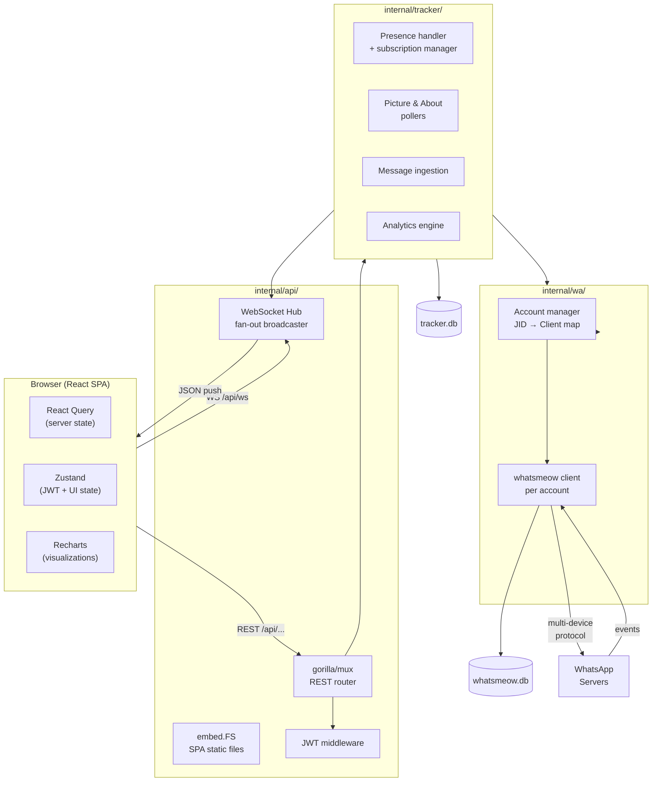
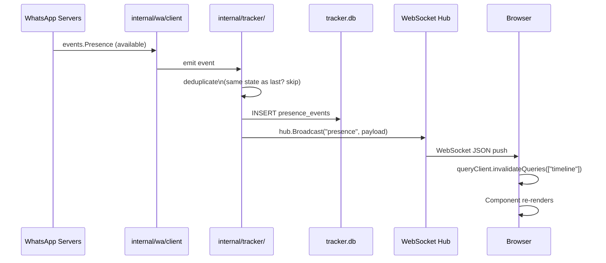
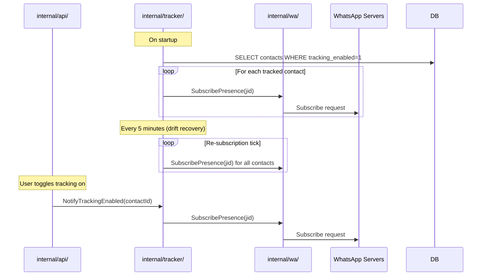
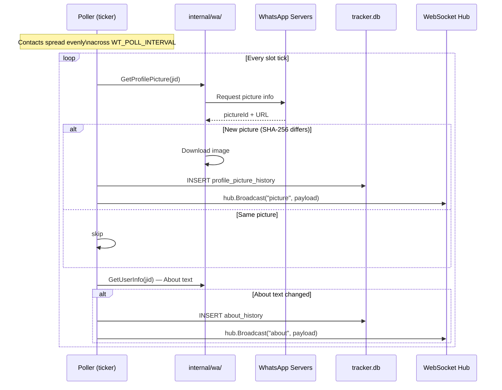
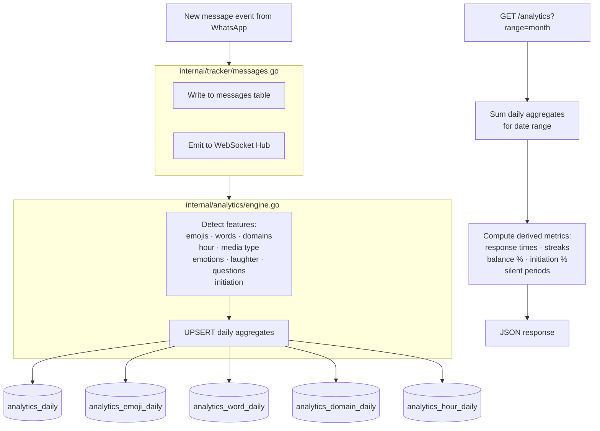
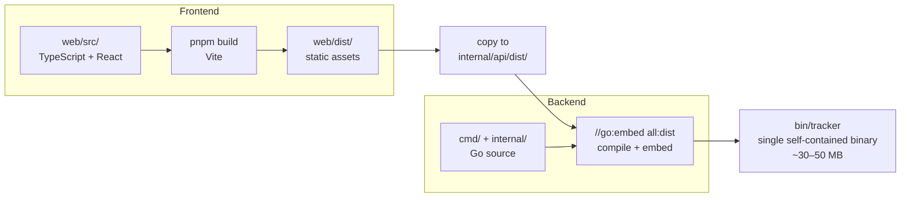
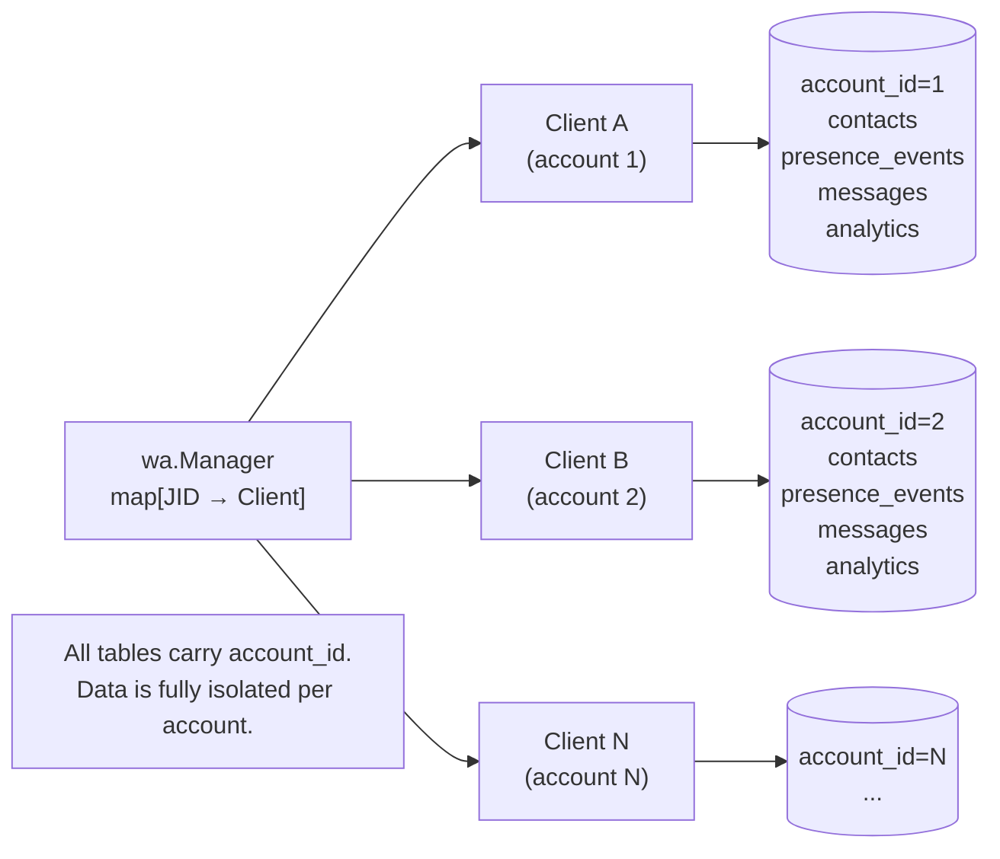
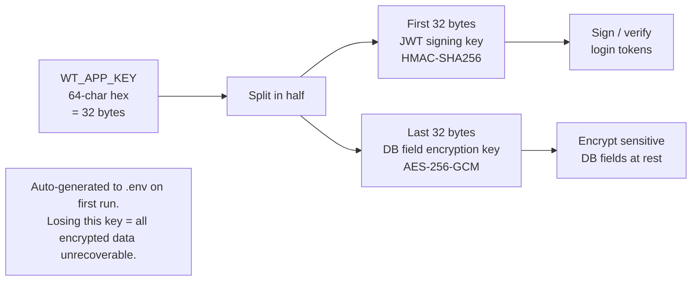

# Architecture

## System Overview

WA Analytics is a single Go binary with an embedded React SPA. At runtime there are no external services — just the binary and two SQLite files.

---

## Three-Layer Backend

### `internal/wa/` — WhatsApp Layer

Wraps the [`whatsmeow`](https://github.com/tulir/whatsmeow) library. Responsibilities:

- **Account manager** (`manager.go`): maintains a `map[JID → *Client]`, starts/stops clients as accounts are added or removed.
- **Client lifecycle**: connects to WhatsApp, handles reconnection, emits raw events.
- **Pairing**: QR code flow and phone number pairing code flow.
- **Event bus**: forwards `events.Presence`, `events.Message`, `events.Picture`, `events.PushName`, `events.LoggedOut`, etc. to the tracker layer.

This layer has no knowledge of the database or HTTP layer.

### `internal/tracker/` — Business Logic Layer

Subscribes to WA events and owns all data collection logic:

- **Presence handler**: receives `events.Presence`, deduplicates consecutive identical states, writes to `presence_events`, broadcasts over WS.
- **Picture poller**: polls every contact once per `WT_POLL_INTERVAL`, compares SHA-256 hashes, writes new rows to `profile_picture_history`, stores image locally, broadcasts.
- **About poller**: same cadence, checks "About" text changes, writes to `about_history`.
- **Message handler**: receives `events.Message`, writes to `messages` and `message_events`, triggers analytics aggregation.
- **Analytics engine** (`internal/analytics/`): incrementally updates `analytics_daily` and related tables on each new message.
- **Subscription manager**: calls `SubscribePresence(jid)` for every `tracking_enabled=1` contact, and re-subscribes every 5 minutes to recover from silent drops.

### `internal/api/` — HTTP / WebSocket Layer

Handles all client-facing concerns:

- **Router** (`server.go`): registers all routes under `gorilla/mux`, applies `requireAuth` JWT middleware.
- **REST handlers**: thin wrappers around DB queries; no business logic here.
- **WebSocket hub** (`hub.go`): fan-out broadcaster. Each connected browser client gets its own goroutine. Slow clients get messages dropped rather than blocking fast ones.
- **Static serving**: the compiled `web/dist/` directory is embedded via `//go:embed all:dist` in `static.go`. All unknown routes serve `index.html` for client-side routing.

---

## Real-Time Event Flow

This sequence shows what happens from a WhatsApp event (e.g. a contact coming online) to the browser re-rendering.

---

## Presence Subscription Lifecycle

---

## Picture & About Polling

---

## Analytics Message Ingestion

---

## Single Binary Build Pipeline

---

## Multi-Account Model

---

## Encryption Key Derivation

---

## Frontend

**Stack:** React 18, React Query 5, Zustand, Recharts, Vite.

- **State**: Zustand (`web/src/lib/store.ts`) holds the JWT token (persisted to `localStorage`) and minimal UI state. All server state is React Query.
- **API calls**: all fetch requests go through `web/src/lib/api.ts`, which attaches the Bearer token and silently refreshes JWTs 30 minutes before expiry.
- **WebSocket**: a single connection is established in `App.tsx` on mount. Incoming messages trigger `queryClient.invalidateQueries()` — there is no separate client-side state store for WS events.
- **Media**: all profile images are served from `/media/` on the local server. The `getMediaUrl` helper in `web/src/lib/media.ts` and the `ContactAvatar` component handle this consistently. External CDN URLs are never used.

---

## Analytics Pre-Aggregation

Rather than running expensive full-table scans on every analytics request, the tracker incrementally writes to a set of daily aggregation tables as messages arrive:

- `analytics_daily` — per-day, per-sender message/word/char/media counts and computed indicators
- `analytics_emoji_daily` — emoji frequency per day per sender
- `analytics_word_daily` — word frequency per day per sender
- `analytics_domain_daily` — shared domain frequency per day per sender
- `analytics_hour_daily` — hourly message counts per day per sender

The API reads and sums these aggregates to answer range queries (week/month/all-time), then computes derived metrics (response times, streaks, initiation percentages) on the fly. This keeps query times consistently fast even over years of data.

See [Database Schema](database.md) for the full table definitions.
