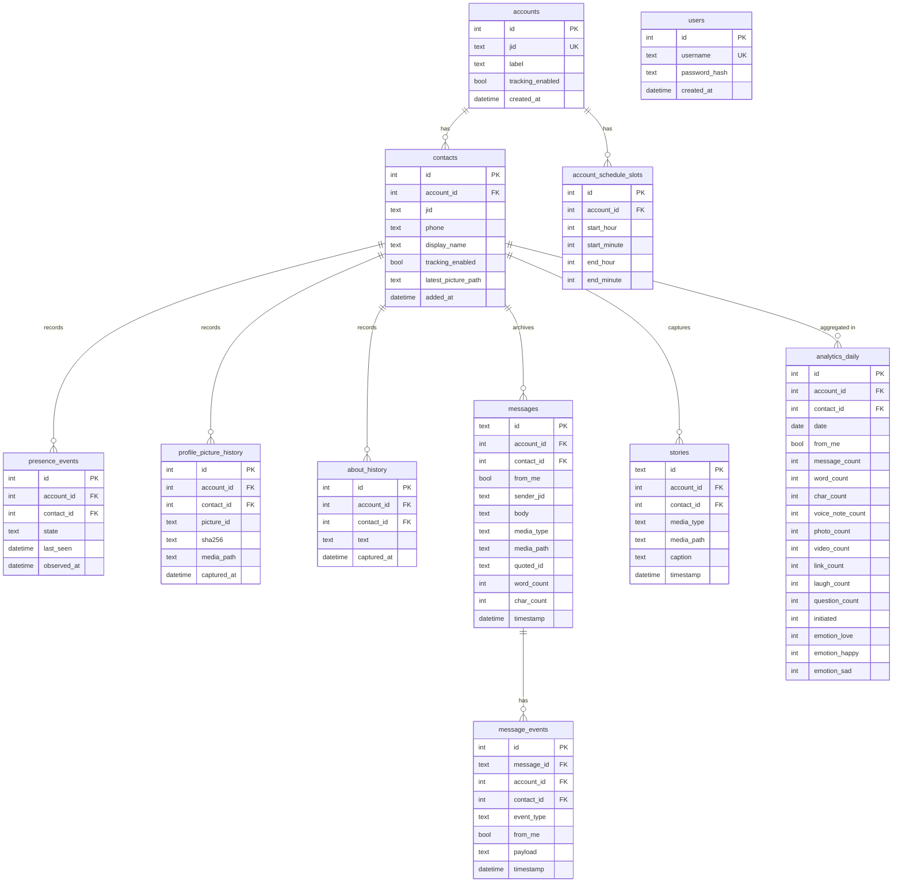
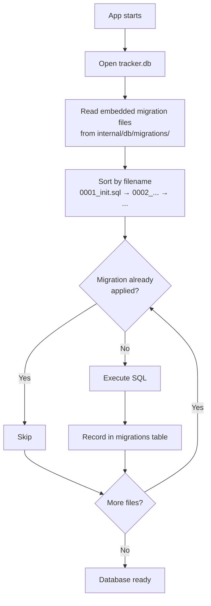
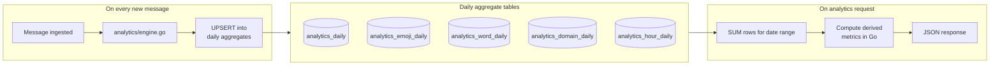

# Database Schema

WA Analytics uses two SQLite files, both stored in `WT_DATA_DIR` (default `~/.local/share/whatsapp-tracker/`).

## Files

| File | Owner | Purpose |
|------|-------|---------|
| `tracker.db` | Application | All app data: contacts, events, messages, analytics |
| `whatsmeow.db` | whatsmeow library | WhatsApp session storage — do not modify |

**Warning:** `whatsmeow.db` is managed entirely by the whatsmeow library. If it is deleted or corrupted, all linked accounts must be re-paired.

## Migrations

Migrations for `tracker.db` live in `internal/db/migrations/` as numbered SQL files (e.g. `0001_init.sql`, `0002_add_accounts.sql`). They are embedded in the binary and run automatically in sorted order on startup. To add a migration, create a new file with the next number — it runs on the next start.

---

## Entity Relationship Diagram



---

## Migration Flow



---

## Core Tables

### `accounts`
One row per linked WhatsApp account.

| Column | Type | Notes |
|--------|------|-------|
| `id` | INTEGER PK | |
| `jid` | TEXT UNIQUE | WhatsApp JID (e.g. `1234567890@s.whatsapp.net`) |
| `label` | TEXT | User-defined name |
| `tracking_enabled` | BOOLEAN | Whether presence subscription is active |
| `created_at` | DATETIME | |

---

### `contacts`
Contacts being tracked under a specific account.

| Column | Type | Notes |
|--------|------|-------|
| `id` | INTEGER PK | |
| `account_id` | INTEGER FK → accounts | |
| `jid` | TEXT | WhatsApp JID |
| `phone` | TEXT | Normalized phone number |
| `display_name` | TEXT | User-defined label |
| `tracking_enabled` | BOOLEAN | Per-contact tracking toggle |
| `latest_picture_path` | TEXT | Path to current profile picture |
| `added_at` | DATETIME | |

---

### `users`
Dashboard login credentials.

| Column | Type | Notes |
|--------|------|-------|
| `id` | INTEGER PK | |
| `username` | TEXT UNIQUE | |
| `password_hash` | TEXT | bcrypt |
| `created_at` | DATETIME | |

---

### `presence_events`
Online/offline state transitions for tracked contacts.

| Column | Type | Notes |
|--------|------|-------|
| `id` | INTEGER PK | |
| `account_id` | INTEGER FK | |
| `contact_id` | INTEGER FK | |
| `state` | TEXT | `available` or `unavailable` |
| `last_seen` | DATETIME | Populated when state = `unavailable` (if visible) |
| `observed_at` | DATETIME | When the event was received |

Consecutive identical states are deduplicated before insert.

---

### `profile_picture_history`
Every profile picture change, one row per detected change.

| Column | Type | Notes |
|--------|------|-------|
| `id` | INTEGER PK | |
| `account_id` | INTEGER FK | |
| `contact_id` | INTEGER FK | |
| `picture_id` | TEXT | WhatsApp picture ID |
| `sha256` | TEXT | Hash of image bytes — used to detect duplicates |
| `media_path` | TEXT | Local path under `WT_DATA_DIR/media/` |
| `captured_at` | DATETIME | |

---

### `about_history`
Every "About" text change, one row per detected change.

| Column | Type | Notes |
|--------|------|-------|
| `id` | INTEGER PK | |
| `account_id` | INTEGER FK | |
| `contact_id` | INTEGER FK | |
| `text` | TEXT | |
| `captured_at` | DATETIME | |

---

### `messages`
Full message archive.

| Column | Type | Notes |
|--------|------|-------|
| `id` | TEXT PK | WhatsApp message ID |
| `account_id` | INTEGER FK | |
| `contact_id` | INTEGER FK | |
| `from_me` | BOOLEAN | Sent vs received |
| `sender_jid` | TEXT | JID of the actual sender (useful in groups) |
| `body` | TEXT | Text content |
| `media_type` | TEXT | `image`, `video`, `audio`, `document`, `sticker`, `url`, or empty |
| `media_path` | TEXT | Local path if media was downloaded |
| `quoted_id` | TEXT | ID of the quoted message, if any |
| `word_count` | INTEGER | Pre-computed at ingest |
| `char_count` | INTEGER | Pre-computed at ingest |
| `timestamp` | DATETIME | |

---

### `message_events`
Reactions, edits, and deletions on top of messages.

| Column | Type | Notes |
|--------|------|-------|
| `id` | INTEGER PK | |
| `message_id` | TEXT FK → messages | |
| `account_id` | INTEGER FK | |
| `contact_id` | INTEGER FK | |
| `event_type` | TEXT | `reaction`, `edit`, `delete` |
| `from_me` | BOOLEAN | |
| `payload` | TEXT | JSON — emoji for reactions, new body for edits |
| `timestamp` | DATETIME | |

---

### `stories`
WhatsApp Stories captured from tracked contacts.

| Column | Type | Notes |
|--------|------|-------|
| `id` | TEXT PK | WhatsApp story ID |
| `account_id` | INTEGER FK | |
| `contact_id` | INTEGER FK | |
| `media_type` | TEXT | |
| `media_path` | TEXT | |
| `caption` | TEXT | |
| `timestamp` | DATETIME | |

---

### `account_schedule_slots`
Active time windows per account. Outside these windows, the account goes presence-invisible.

| Column | Type | Notes |
|--------|------|-------|
| `id` | INTEGER PK | |
| `account_id` | INTEGER FK | |
| `start_hour` | INTEGER | 0–23 |
| `start_minute` | INTEGER | 0–59 |
| `end_hour` | INTEGER | 0–23 |
| `end_minute` | INTEGER | 0–59 |

Slots where `start > end` wrap overnight (e.g. 22:00–06:00).

---

### `app_meta`
Key-value store for internal application metadata.

| Column | Type |
|--------|------|
| `key` | TEXT PK |
| `value` | TEXT |

---

## Analytics Tables

These tables are incrementally written by the tracker as messages arrive. The API reads and aggregates them to answer range queries without scanning the full `messages` table.

### Analytics Write vs Read Pattern



---

### `analytics_daily`
One row per `(account_id, contact_id, date, from_me)`.

| Column | Type | Notes |
|--------|------|-------|
| `id` | INTEGER PK | |
| `account_id` | INTEGER FK | |
| `contact_id` | INTEGER FK | |
| `date` | DATE | YYYY-MM-DD |
| `from_me` | BOOLEAN | Sender side |
| `message_count` | INTEGER | |
| `word_count` | INTEGER | |
| `char_count` | INTEGER | |
| `voice_note_count` | INTEGER | |
| `photo_count` | INTEGER | |
| `video_count` | INTEGER | |
| `sticker_count` | INTEGER | |
| `document_count` | INTEGER | |
| `link_count` | INTEGER | |
| `laugh_count` | INTEGER | Detected laughter patterns |
| `question_count` | INTEGER | Messages containing `?` |
| `initiated` | INTEGER | Sessions started by this sender |
| `emotion_love` | INTEGER | Emotion category counts |
| `emotion_miss` | INTEGER | |
| `emotion_happy` | INTEGER | |
| `emotion_sad` | INTEGER | |
| `emotion_care` | INTEGER | |
| `emotion_encourage` | INTEGER | |
| `emotion_apology` | INTEGER | |
| `emotion_gratitude` | INTEGER | |

---

### `analytics_emoji_daily`
| Column | Type |
|--------|------|
| `id` | INTEGER PK |
| `account_id` | INTEGER FK |
| `contact_id` | INTEGER FK |
| `date` | DATE |
| `from_me` | BOOLEAN |
| `emoji` | TEXT |
| `count` | INTEGER |

---

### `analytics_word_daily`
| Column | Type |
|--------|------|
| `id` | INTEGER PK |
| `account_id` | INTEGER FK |
| `contact_id` | INTEGER FK |
| `date` | DATE |
| `from_me` | BOOLEAN |
| `word` | TEXT |
| `count` | INTEGER |

---

### `analytics_domain_daily`
| Column | Type |
|--------|------|
| `id` | INTEGER PK |
| `account_id` | INTEGER FK |
| `contact_id` | INTEGER FK |
| `date` | DATE |
| `from_me` | BOOLEAN |
| `domain` | TEXT |
| `count` | INTEGER |

---

### `analytics_hour_daily`
| Column | Type | Notes |
|--------|------|-------|
| `id` | INTEGER PK | |
| `account_id` | INTEGER FK | |
| `contact_id` | INTEGER FK | |
| `date` | DATE | |
| `from_me` | BOOLEAN | |
| `hour` | INTEGER | 0–23 |
| `count` | INTEGER | |

---

## Backfill

If you have existing message history before analytics tables were introduced, run the backfill tool:

```bash
./bin/tracker-analytics-backfill -data <WT_DATA_DIR>
```

This reprocesses all rows in `messages` and repopulates the analytics tables from scratch.
