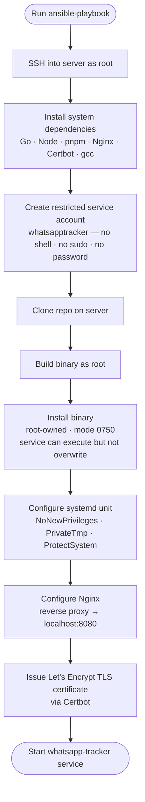
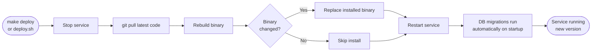

# Server Deployment Guide

This guide walks through deploying WA Analytics on a VPS or dedicated server so it runs continuously 24/7, accessible from anywhere via a real domain with HTTPS.

For local machine installation, see the [main README](../README.md).

---

## What you need before starting

**A server** — any Ubuntu 22.04 LTS (or Debian 12) VPS works. Popular options:
- [DigitalOcean](https://digitalocean.com) — Droplet, $6/month, 1 GB RAM is enough
- [Hetzner](https://hetzner.com) — €4/month, excellent value
- [Vultr](https://vultr.com), [Linode](https://linode.com) — similar options

Minimum spec: **1 GB RAM, 1 vCPU, 10 GB disk**. The app is lightweight; an entry-level instance is fine.

**A domain name** — any registrar works (Namecheap, Cloudflare, etc.). You'll point it at your server's IP address.

**SSH access to the server as root** — your VPS provider gives you this when the server is created.

**Git cloned locally** — you run the deployment commands from your own machine, not the server.

---

## Step 1 — Point your domain at the server

In your domain registrar's DNS settings, create an **A record**:

| Type | Name | Value |
|------|------|-------|
| A | `@` or `wa` | your server's IP address |

For example, if your server IP is `203.0.113.10` and you want the app at `wa.example.com`, set:
- Type: `A`
- Name: `wa`
- Value: `203.0.113.10`

DNS changes can take up to 30 minutes to propagate. You can check with:
```bash
dig wa.example.com
```

> **This step must be done before running the installer**, because the HTTPS certificate setup requires the domain to already point at the server.

---

## Step 2 — Clone the repo on your local machine

If you haven't already:
```bash
git clone https://github.com/ibrahimalshekh/whatsapp-tracker.git
cd whatsapp-tracker
```

All deployment commands are run from this directory on your local machine.

---

## Option A — Automated setup with Ansible (recommended)

Ansible is a tool that connects to your server over SSH and runs all setup steps automatically. You don't need to log in to the server manually.

### What Ansible does



### Install Ansible

**macOS:**
```bash
brew install ansible
```

**Linux / Windows (WSL):**
```bash
pip install ansible
```

### Configure the server details

Edit `ansible/inventory.ini`:

```ini
[whatsapp_tracker]
203.0.113.10 ansible_user=root ansible_ssh_private_key_file=~/.ssh/id_rsa

[whatsapp_tracker:vars]
domain=wa.example.com
email=you@example.com
repo_url=https://github.com/ibrahimalshekh/whatsapp-tracker.git
```

Replace:
- `203.0.113.10` with your server's IP address
- `~/.ssh/id_rsa` with the path to your SSH private key
- `wa.example.com` with your domain
- `you@example.com` with your email (used for the SSL certificate)

### Run the setup

```bash
ansible-playbook ansible/playbook.yml -i ansible/inventory.ini
```

Or with the shortcut:
```bash
make setup
```

This will take a few minutes. It installs all dependencies on the server, builds the app, sets up a systemd service, configures Nginx as a reverse proxy, and issues a free Let's Encrypt TLS certificate.

### Security model after setup

| Path | Owner | Mode | Notes |
|------|-------|------|-------|
| `/home/whatsapptracker/bin/whatsapp-tracker` | `root` | `0750` | Service can execute, not overwrite |
| `/home/whatsapptracker/.local/share/whatsapp-tracker/` | `whatsapptracker` | `0700` | App data + `.env` key |
| `/etc/systemd/system/whatsapp-tracker.service` | `root` | `0644` | System file |
| `/etc/nginx/sites-available/whatsapp-tracker` | `root` | `0644` | System file |

---

## Option B — Manual setup with a shell script

If you'd rather not use Ansible, a single shell script handles everything. It runs **on the server** and requires sudo.

### SSH into your server

```bash
ssh root@203.0.113.10
```

### Clone the repo on the server

```bash
git clone https://github.com/ibrahimalshekh/whatsapp-tracker.git
cd whatsapp-tracker
```

### Run the setup script

```bash
./scripts/server/setup-service.sh wa.example.com you@example.com
```

Replace `wa.example.com` and `you@example.com` with your domain and email.

The script installs all dependencies, builds the binary, creates a systemd service, configures Nginx, and issues an SSL certificate.

---

## Step 3 — First login

After the setup completes (either option), open your browser and visit:

```
https://wa.example.com
```

Because no user account exists yet, the app redirects to the **register** page automatically. Create your admin account there.

> Once the first account is created, the register page is permanently closed. Any further registration attempts are rejected with a `403` error.

---

## Step 4 — Back up your encryption key

**Do this immediately after first login.** The app auto-generates a secret encryption key on first start. Without it, your stored data cannot be recovered if the server is lost.

```bash
ssh root@203.0.113.10 "cat /home/whatsapptracker/.local/share/whatsapp-tracker/.env"
```

Copy the output and store it somewhere safe (password manager, encrypted notes, etc.).

---

## Deploy Updates



**Using Ansible (from your local machine):**
```bash
ansible-playbook ansible/deploy.yml -i ansible/inventory.ini
# or:
make deploy
```

**Using the manual script (from the server):**
```bash
cd /path/to/whatsapp-tracker
./scripts/server/deploy.sh
```

---

## Managing the Server Service

```bash
# Check if the app is running
systemctl status whatsapp-tracker

# Restart the app
systemctl restart whatsapp-tracker

# Stop the app
systemctl stop whatsapp-tracker

# Live logs
journalctl -u whatsapp-tracker -f

# Check Nginx is running
systemctl status nginx

# Test SSL certificate renewal (safe, doesn't actually renew)
certbot renew --dry-run
```

---

## Backing Up Your Data

### Encryption key

Located at `/home/whatsapptracker/.local/share/whatsapp-tracker/.env`. Back this up first — it is the most critical file.

### Database via the API

```bash
curl -H "Authorization: Bearer <your-jwt-token>" \
  https://wa.example.com/api/backup \
  -o tracker-backup.db
```

### Database via SSH

```bash
scp root@203.0.113.10:/home/whatsapptracker/.local/share/whatsapp-tracker/tracker.db ./backup.db
```

---

## Troubleshooting

| Problem | Fix |
|---------|-----|
| Ansible can't connect | Check SSH key path in `inventory.ini`; confirm `ssh root@<ip>` works manually |
| SSL certificate fails | Make sure your domain's A record points to the server and DNS has propagated (`dig <domain>`) |
| App not starting | Run `journalctl -u whatsapp-tracker -f` to see the error |
| Nginx 502 Bad Gateway | The app isn't running — check `systemctl status whatsapp-tracker` |
| Can't reach the domain | Check Nginx (`systemctl status nginx`) and firewall (`ufw allow 80 && ufw allow 443`) |
| Out of disk space | Check with `df -h`; media files grow over time — they're at `/home/whatsapptracker/.local/share/whatsapp-tracker/media/` |
